# Lab 6 Microservices - Project Report
# David Borrel Seral - 871643

## 1. Configuration Setup

**Configuration Repository**: https://github.com/dborrel/lab6-microservices

Describe the changes you made to the configuration:

- **What did you modify in `accounts-service.yml`?**
    He modificado `accounts-service.yml` cambiando el puerto de 3333 a 2222 en la tarea 3.
    Para realizar el bonus RESTful API Documentation he vuelto a la configuración inicial.
- **Why is externalized configuration useful in microservices?**
    - Permite cambiar la configuración sin tener que recompilar el código.
    - Permite realizar una gestión centralizadad desde un único punto de todos los microservicios.
    - Permite ejecutar multiples instancias con distintos puertos.

---

## 2. Service Registration (Task 1)

### Accounts Service Registration

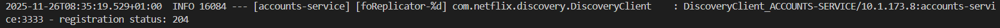

**Explain what happens during service registration.**
    1. Lee su configuración del Config Server.
    2. Se registra en Eureka enviando su nombre, IP y puerto.
    3. Recibe el código 204 confirmando que se ha registrado con éxito.
    4. Empieza a enviar heartbeats cada 30 segundos. 

### Web Service Registration

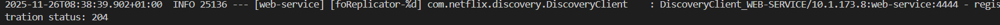

**Explain how the web service discovers the accounts service.**
    1. Se registra en Eureka de la misma forma que el servicio Accounts.
    2. Utiliza `@LoadBlanced RestTemplate` para llamar a `http://ACCOUNTS-SERVICE/accounts`.
    3. Spring Cloud LoadBalancer realiza la consulta a Eureka para obtener las instancias disponibles.
    4. Selecciona una instancia automáticamente y reemplaza el nombre lógico por la IP:puerto real

---

## 3. Eureka Dashboard (Task 2)

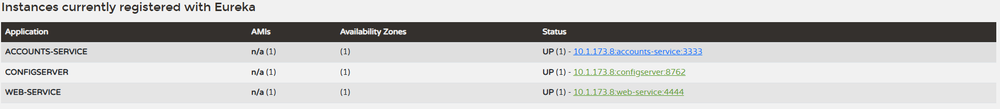

**Describe what the Eureka dashboard shows:**
    El Eureka Dashboard proporciona una vista general del estado del servidor Eureka y de las instancias registradas dentro del sistema de microservicios. La información presentada permite monitorizar disponibilidad, salud de los servicios, y el estado general del entorno.

    Contiene tres secciones:
        - System Status - Muestra el estado general del servidor Eureka (Environment, Data center, Uptime, etc.)
        - DS Replicas - Lista las instancias registradas en Eureka.
        - General Info - Contiene datos internos del servidor Eureka (total-avail-memory, num-of-cpus, etc.)
        - Instance Info - Información específica sobre la propia instancia del servidor Eureka (ipAddr, status)

- ** Which services are registered?**
    - ACCOUNTS-SERVICE
    - CONFIGSERVER
    - WEB-SERVICE
- ** What information does Eureka track for each instance?**
    - Nombre de la aplicación (Application ID)
    - AMIs (Amazon Machine Images)
    - Availability Zones
    - Estado de la instancia (UP, DOWN)
    - Dirección de la instancia (IP:app-name:port)

---

## 4. Multiple Instances (Task 4)

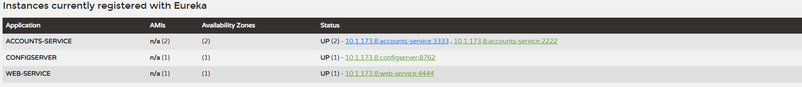

Answer the following questions:

- **What happens when you start a second instance of the accounts service?**
    La segunda instancia se registra en Eureka con el mismo nombre (ACCOUNTS-SERVICE) pero distinto Instance ID, la primera instancia se registra en el puerto 3333 y la segunda en el 2222. Ambas instancias coexisten independientemente.
- **How does Eureka handle multiple instances?**
    Eureka mantiene una lista de todas las instancias bajo el mismo nombre de servicio, pero cada instancia tiene un ID único se monitorizan de forma independiente.
- **How does client-side load balancing work with multiple instances?**
    El Web Service obtiene un listado con todas las instancias disponibles de Eureka, de forma que Spring Cloud LoadBalancer usa Round Robin por defecto: alterna entre instancias secuncialmente (Request 1 -> 3333, Request 2 -> 2222, Request 3 -> 3333, etc.)

---

## 5. Service Failure Analysis (Task 5)

### Initial Failure

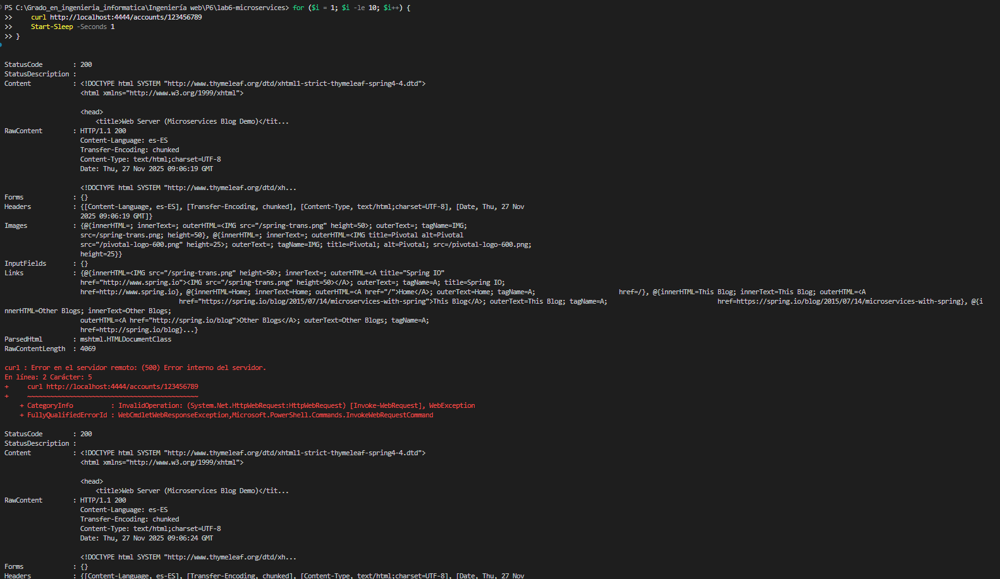

**Describe what happens immediately after stopping the accounts service on port 3333.**
    Cuando se detiene la instancia del puerto 3333, la mitad de las peticiones fallan (Connection refused). Las peticiones dirigidas a 2222 siguen funcionando correctamente. El Web Service aún tiene en caché que la instancia 3333 está en estado UP.

### Eureka Instance Removal

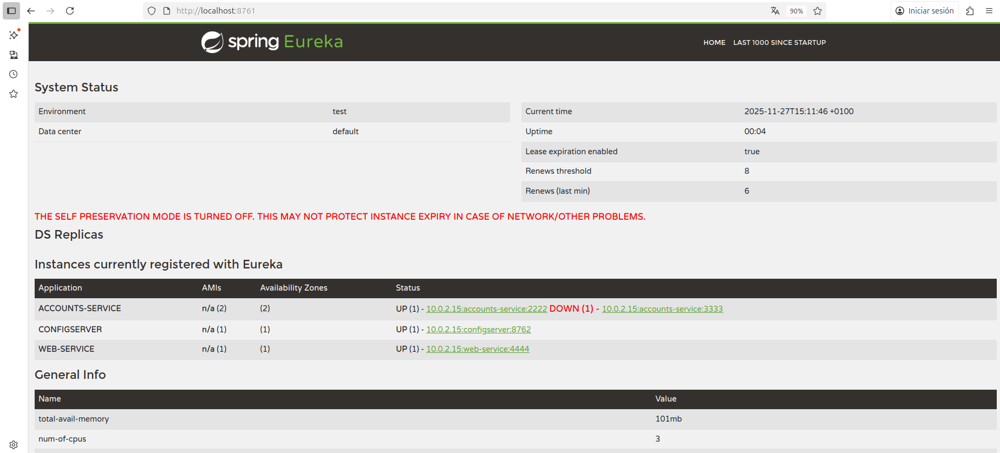

**Explain how Eureka detects and removes the failed instance:**

- **How long did it take for Eureka to remove the dead instance?**
    Al momento de tirar la instancia 3333, esa instancia ya pasa a estar en estado DOWN en Eureka, y al segundo ya desaparece de Eureka.
- **What mechanism does Eureka use to detect failures?**
    Eureka espera que llegue un heartbeat cada 30 segundos, y pasado ese tiempo ya detecta la caída. Depués el Web Service refresca su caché (30s) y deja de enviar peticiones a 3333.
---

## 6. Service Recovery Analysis (Task 6)

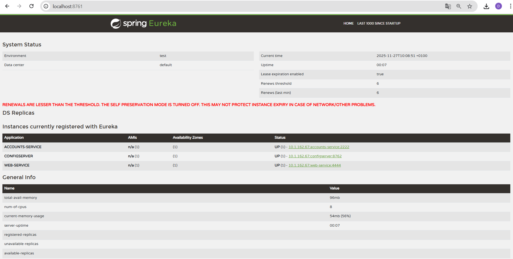

**Answer the following questions:**

- **Why does the web service eventually recover?**
    Después de detectar el fallo, Eureka elimina la instancia caída (3333) de su registro. Después, el Web Service actualiza su cache y obtiene solo la instancia disponible (2222). A partir de ahí, todas las peticiones se dirigen automáticamente a 2222.
- **How long did recovery take?**
    3-4 minutos desde el fallo hasta la recuperación completa.
- **What role does client-side caching play in the recovery process?**
    El cliente ya no consulta Eureka en cada petición, por lo que reduce la carga en el servidor Eureka.
---

## 7. Conclusions

**Summarize what you learned about:**

- Microservices architecture
- Service discovery with Eureka
- System resilience and self-healing
- Challenges you encountered and how you solved them

Esta sesión de laboratorio ha sido muy útil para poder ver como funciona una arquitectura de microservicios y como es la comunicación entre ellos. 

Además esta práctica ha sido de utilidad para poner en práctica los conocimientos aprendidos en la asignatura Sistemas Distribuidos, viendo como el cliente distribuye el tráfico automáticamente entre múltiples instancias y como el sistema se auto-recupera de fallos sin intervención manual (mencanismo de heartbeats). En la asignatura de Sistemas Distribuidos se estudió el algoritmo de Raft, que también utilizaba los heartbeats para detectar fallos de las instancias.

También se ha comprendido la utilidad de tener un Config Server que centraliza y simplifica la configuración de toda el sistema.

Uno de los retos más complicados de esta práctica ha sido comprender la arquitectura y como funcionaba la comunicación entre microservicios, una vez se ha comprendido esto, el resto de la práctica se ha podido realizar sin problemas.

---

## 8. AI Disclosure

**Did you use AI tools?** (ChatGPT, Copilot, Claude, etc.)

AI Tools Used: Claude AI

Se ha utilizado esta IA para dos tareas:
- Para comprender la arquitectura de este sistema, al principio le pedí que me dibujara unos diagramas de secuencia de esta arquitectura y que me explcará bien que hacía cada servicio y como se comunicaban entre ellos. Esto me fue muy útil para entender todo el sistema antes de ponerme a hacer las tareas.
- También he utilizado la IA para solucionar unos errores que tenía al implementar el Circuit Breaker, el problema que tenía era que el circuit breaker no se estaba activando porque la excepción estaba ocurriendo antes de que Resilience4j pudiera interceptarla. Esto sucedía porque el @CircuitBreaker funciona mediante proxies de Spring AOP, que solo interceptan llamadas desde fuera de la clase.

El resto de la práctica ha sido desarrollado por mí. Para la realización de los dos bonus, he buscado bastante documentación en la web de Spring Boot para poder ver ejemplos de implementaciones.

Esta práctica ha sido de mucha utilidad para comprender como funcionan los microservicios, que permiten construir sistemas distribuidos donde cada componente funciona de manera independiente, y Eureka actúa como el intermediario que permite que estos servicios se encuentren dinámicamente sin necesidad de hadcodear IPs o puertos. 

Además en el Report 2, también propuse una arquitectura de microservicios, por lo que esta sesión de laboratio me ha parecido muy interesante para poder aplicar todos los conocimientos aprendidos durante la redacción del Report 2.

---

## 9. Bonus 1: RESTful API Documentation

**Implementación:** SpringDoc OpenAPI 3 con Swagger UI

### Detalles de implementación
- Se ha añadido la de dependecia de SpringDoc a los servicios `acounts` y `web`.
- Se ha creado la clase `OpenApiConfig` en los dos servicios para configurar los metadatos de la API.
- Se han modificado los controladores para añadir anotaciones OpenAPI para documentación detallada.
- Se han habilitado pruebas de API interactivas a través de Swagger UI.

### Screenshots

#### Accounts API Documentation
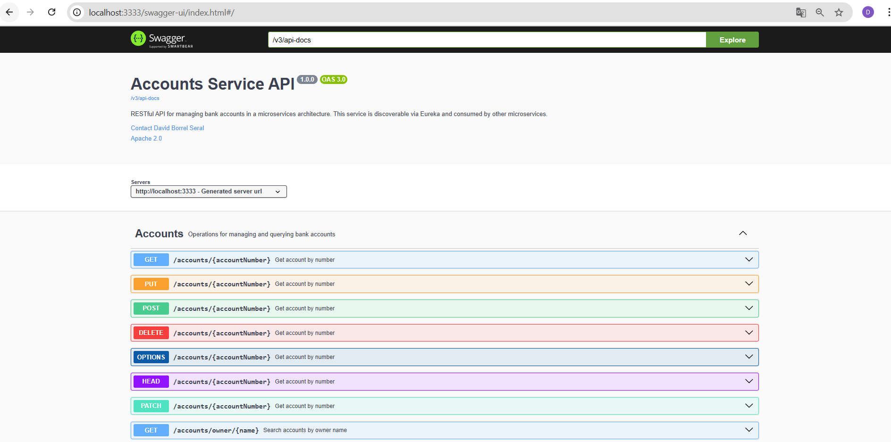

#### Web API Documentation
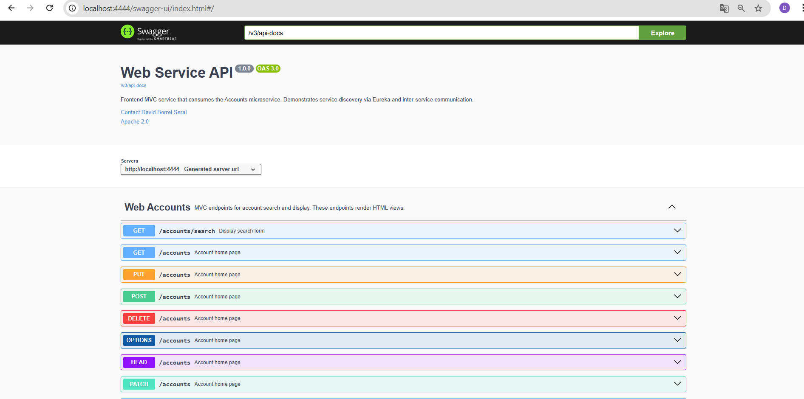

#### API Testing Example
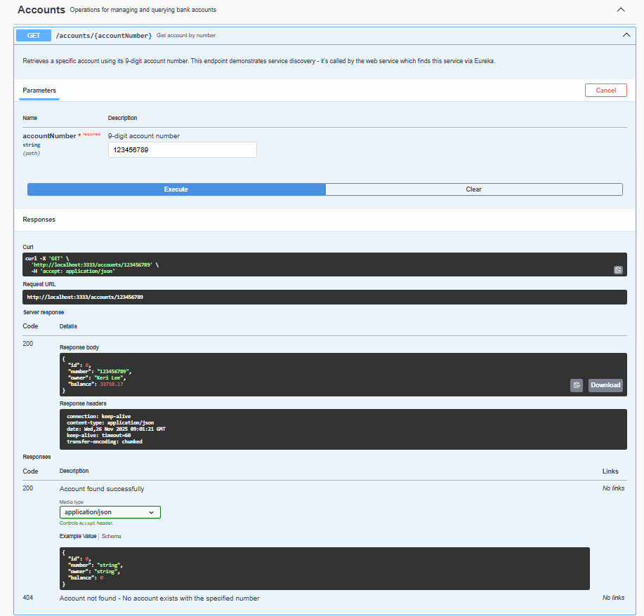

### Beneficios
- **Documentación interactiva**: Los desarrolladores pueden probar los endpoints directamente desde el navegador.
- **Auto-generado**: La documentación se actualiza atuomáticamente cuando hay cambios en el código.
- **Reduce el trabajo manual**: No es necesaria mantener una documentación manual de la API, de esta forma se realiza automaticamente.

### Endpoints de acceso
- Accounts Service: http://localhost:3333/swagger-ui.html
- Web Service: http://localhost:4444/swagger-ui.html

### Referencias
- https://spring.io/guides/gs/testing-restdocs
- https://www.baeldung.com/spring-rest-openapi-documentation
- https://www.geeksforgeeks.org/springboot/spring-boot-rest-api-documentation-using-swagger/

---
## 9. Bonus 2: 10. Circuit Breaker Pattern

**Implementación:** Spring Cloud Circuit Breaker con Resilience4j

### Descripción
Se ha implementado el patrón Circuit Breaker para prevenir fallos en cascada cuando el servicio de accounts no está disponible.

### Detalles de implementación

#### 1. Dependencias añadidas
Se han añadido las dependencias de Resilence4j en el `build.gradle.kts` del servicio Web.

#### 2. Configuración en `application.yml`
La configuración define un circuit breaker llamado accountsService en Resilience4j que se activará cuando el 50% de las últimas 10 llamadas fallen, siempre que haya al menos 5 llamadas evaluadas. Una vez abierto, permanecerá 10 segundos antes de permitir hasta 3 llamadas de prueba en estado half-open para comprobar si el servicio se ha recuperado.

#### 3. Modificaciones en `WebAccountsService`
- Inyección de `CircuitBreakerFactory<?, ?>`
- Métodos `findByNumber()` y `byOwnerContains()` envueltos con circuit breaker
- Métodos de fallback que devuelven respuestas por defecto cuando el servicio falla

### Screenshots

#### Estado CLOSED (funcionamiento normal)
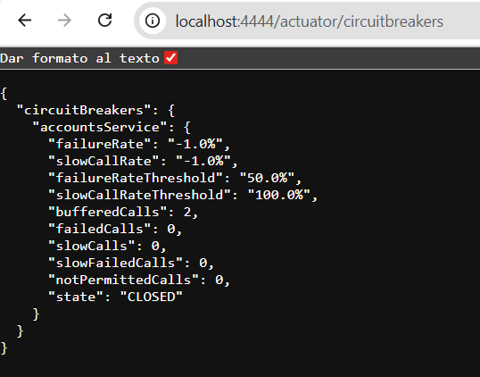

#### Estado OPEN (servicio caído)
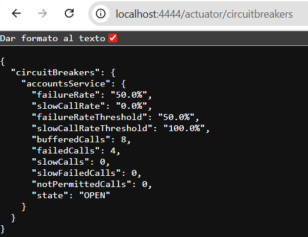

#### Estado HALF-OPEN (probando recuperación)
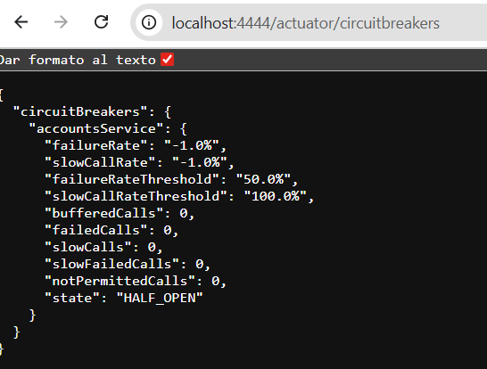

#### Eventos del circuit breaker
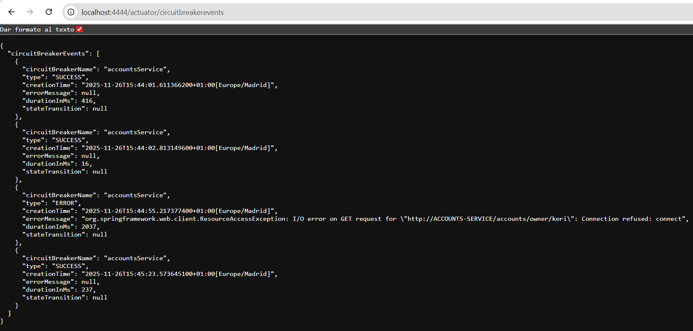

### Estados del Circuit Breaker
| Estado | Descripción | Comportamiento |
|--------|-------------|----------------|
| **CLOSED** | Funcionamiento normal | Todas las peticiones pasan al servicio accounts |
| **OPEN** | Servicio fallando | Peticiones fallan inmediatamente con respuesta de fallback |
| **HALF_OPEN** | Probando recuperación | Permite algunas peticiones para verificar si el servicio se recuperó |

### Endpoints de monitorización
- Circuit Breakers: http://localhost:4444/actuator/circuitbreakers
- Eventos: http://localhost:4444/actuator/circuitbreakerevents
- Métricas: http://localhost:4444/actuator/metrics/resilience4j.circuitbreaker.state

### Beneficios
- **Prevención de fallos en cascada**: Produce fallos rápidos sin sobrecargar servicios caídos
- **Degradación controlada**: Respuestas de fallback en lugar de errores
- **Recuperación automática**: Detecta cuando el servicio vuelve a estar disponible

### Referencias
- https://www.geeksforgeeks.org/advance-java/spring-boot-circuit-breaker-pattern-with-resilience4j/
- https://www.baeldung.com/spring-boot-resilience4j
- https://spring.io/projects/spring-cloud-circuitbreaker
- https://www.youtube.com/watch?v=OxGr2eB911s
---
## Additional Notes

Any other observations or comments about the assignment.

